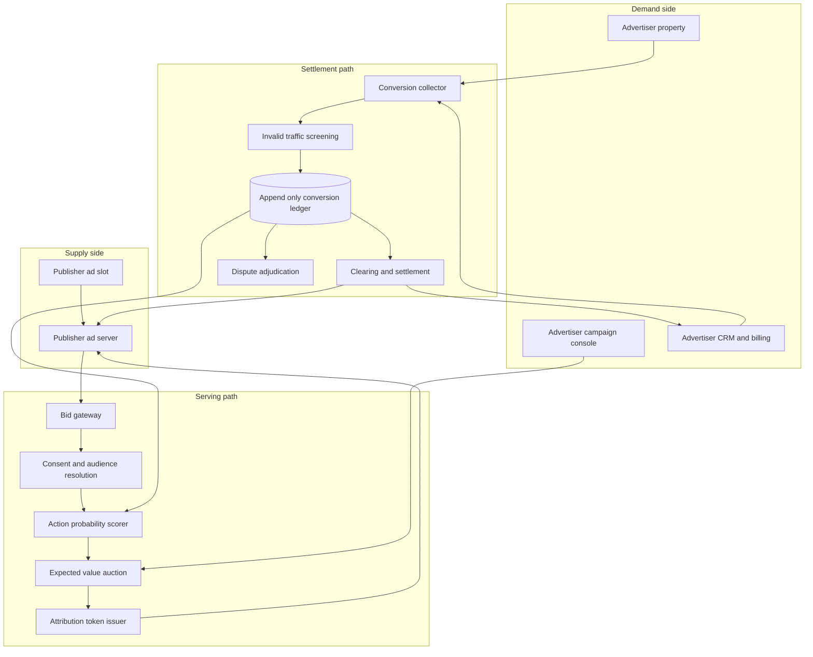

# Clearbid

**Source:** `ai-in-advertizing/Ubex-Whitepaper-en/`
**Domain:** `ai-advertising`
**One-liner:** A cost-per-action advertising exchange that settles media spend only against mutually verified conversions, so performance advertisers stop paying for bot traffic and publishers stop being shaved on payouts.
**Wedge:** Mid-market direct-response advertisers (lead-gen: insurance, fintech, education, travel) buying display and in-app inventory at $50k–$1M monthly, paired with long-tail publishers whose remnant inventory is under-monetised by open RTB.
**Positioning:** A settlement-grade programmatic exchange. Existing exchanges optimise for impression yield and reconcile on advertiser-reported numbers; Clearbid makes the conversion record itself the shared, tamper-evident source of truth, then prices inventory on predicted action probability rather than predicted click-through.

## Market research synthesis

### Thesis from source

The source argues that programmatic advertising has won the structural argument but lost the trust argument. It sizes the global ad market at roughly $465B (2015), $493B (2016), and $500B (2017), and marks 2017 as the crossover year when internet advertising ($192B) passed television for the first time. Within that, programmatic is the fastest-moving segment: growth above 23–25% annually against roughly 4% for non-programmatic, reaching about $24B and forecast by Magna Global to hit $42B by 2020–2021, at which point software-bought inventory exceeds manually-bought inventory.

Against that growth, the document catalogues three cost drivers that inflate customer acquisition cost for advertisers. First, intermediation: agencies and the ad-tech chain take roughly 10–20% in agency commission alone, with the full chain inflating marketing budgets to two or three times the publisher's original asking price, and with advertisers receiving neither the algorithms nor the audience detail behind the spend (about ±30% effect on CAC). Second, fraud under pay-per-click: AppLift and Forensiq found roughly 34% of mobile ad displays suspicious with 22% outright fraudulent; Videology-based estimates place 2015 losses at $6.3B and 2016 at $7.3B; Juniper Research forecasts $44B of losses by 2022; Incapsula estimates bots generate up to 52% of traffic to advertiser sites; Forrester found 92% of advertisers with display budgets over $1M rank fraud as their primary problem (another ±30%). Third, weak targeting that serves ads outside the target segment and depresses conversion (about ±20%). The document's aggregate claim is that removing these three drivers halves customer acquisition cost.

The document's most useful insight is not "use a neural network" but the *symmetry* problem that blocks the obvious fix. Everyone agrees cost-per-action is the honest model — simulating a registration, a callback request, or a purchase is far more expensive than simulating a click. But CPA merely moves the fraud from the publisher to the advertiser. Under CPA the publisher's revenue depends entirely on the advertiser truthfully reporting conversions, and the document names the resulting publisher-side risks directly: shaving (the advertiser conceals conversions that did occur), plus non-payment and disputed attribution. The publisher has no technical means to audit the advertiser's own database. The paper's conclusion is that no company on the market solves this, and that the market therefore needs a shared, verifiable record of user actions across both the publisher's property and the advertiser's property.

From this the product design follows. The commercially defensible object is a neutral conversion ledger that both counterparties can verify but neither can unilaterally rewrite, with settlement executed automatically against that ledger, and with bidding driven by predicted probability of a *target action* and its economic value rather than predicted clicks. The source's comparison table is instructive about the wedge: it scores traditional exchanges as moderate on targeting, moderate on lead cost, and moderate on fraud risk, while direct publisher deals score high on purchasing complexity. The gap is a channel that is simultaneously low-effort to buy and low-risk to settle.

### Buyer & economic model

- **Primary buyer:** VP of Performance Marketing or Head of Growth at a direct-response advertiser; on the supply side, the Head of Monetisation or Ad Operations Director at a publisher network.
- **Users:** campaign managers and media buyers (daily), ad operations and yield managers (daily), finance and revenue assurance analysts (monthly reconciliation), fraud/quality analysts (investigations), compliance and privacy officers (consent and data-use review).
- **Budget owner / value metric:** the performance media budget. The value metric is verified cost per action and the share of spend that clears without dispute; secondary metrics are the intermediation take-rate removed and the fraud loss avoided.
- **Competing status quo:** open RTB through a DSP plus an agency trading desk, wrapped in third-party verification (viewability and invalid-traffic vendors) and manual monthly reconciliation between advertiser-reported conversions and publisher-reported impressions, with disputes settled by email and credit memos. Affiliate networks are the nearest CPA-native competitor and are trusted less because the network both brokers and reports.

### Domain constraints

- **Regulatory / trust / safety:** consent-based tracking and purpose limitation under modern privacy regimes; cross-domain attribution must work under browser restrictions on third-party identifiers; advertiser brand safety and publisher content-adjacency controls; the neutrality of the exchange itself must be demonstrable, since an exchange that can silently edit conversion records is exactly the failure mode being sold against.
- **Data sensitivity:** the conversion record is commercially sensitive on both sides — publishers must not learn advertiser revenue-per-customer, and advertisers must not receive raw user-level data from publisher properties. Verification must therefore expose proofs and counts, not underlying personal data.
- **Change-management realities:** advertisers cannot switch attribution models in a quarter; the exchange must run alongside incumbent measurement and reconcile against it. Publishers will not replace their primary stack for an unproven demand source, so the entry point is remnant and secondary inventory. Both sides require settlement terms, credit checks, and deferred payment for high-rated advertisers, as the source notes.

## Business requirements

- BR-1: Every unit of spend settles against a conversion record that both the advertiser and the publisher can independently verify, and no settlement may be executed against a record that only one party can see.
- BR-2: The platform must support payment on defined target actions — registration, form completion, callback request, purchase — as the primary commercial model, with impression and click pricing available only as fallback for campaigns in learning phase.
- BR-3: Advertisers must achieve a measurable reduction in verified cost per action versus their incumbent buying channel within one full campaign cycle, and the platform must report this comparison rather than assert it.
- BR-4: Publishers must be protected against shaving: any advertiser-side conversion that the ledger recorded must either settle or enter a time-boxed dispute with a documented resolution, and unresolved disputes must resolve in favour of the recorded evidence.
- BR-5: Invalid traffic detected before settlement must be excluded from billing automatically, with the exclusion itemised to both counterparties, so that fraud handling is a routine accounting event rather than a negotiated credit.
- BR-6: Buying must be self-serve enough that an advertiser can launch a targeted campaign without an agency intermediary, and the platform's own take-rate must be disclosed as a single line rather than embedded in the clearing price.
- BR-7: Campaign targeting and bid decisions must be explainable to the advertiser at the level of audience segment, predicted action probability, and expected economic value per placement, because opaque optimisation is one of the named reasons buyers distrust incumbents.
- BR-8: All personal data used for targeting must be processed on a lawful consent basis with purpose limitation, and verification must be achievable without transferring user-level data between counterparties.
- BR-9: Publisher payouts must be predictable: the platform must publish expected settlement timing, minimum payout thresholds, and a credit policy for deferred-payment advertisers, with advertiser rating governing eligibility.
- BR-10: Both sides must be able to export an auditable statement for any period that ties recorded actions to invoiced amounts, suitable for finance reconciliation and external audit.
- BR-11: Brand safety and content-category controls must be enforceable by advertisers before serving, and publishers must be able to block advertiser categories, with violations creating a settlement-blocking event.
- BR-12: The exchange must be able to demonstrate its own neutrality — that it cannot retroactively alter a recorded conversion — as a contractual and reportable property, not merely a technical claim.

## User stories

Canonical user stories live in sibling [USER_STORIES.md](USER_STORIES.md).

## System design

### Overview

Clearbid sits between advertiser demand and publisher supply as both a bidding system and a clearing house. On the serving path, a publisher ad request triggers audience resolution, action-probability scoring per eligible campaign, an expected-value bid, and ad delivery — all within the real-time window that the source describes as roughly 100–200 milliseconds. On the settlement path, the conversion event generated on the advertiser's property is bound to the original impression through a signed, cross-domain attribution token, written to an append-only conversion ledger that both counterparties can read, screened for invalid traffic, then converted into a settlement instruction. The two paths meet in the model: verified conversions become training data for the next round of action-probability scoring, which is what allows pricing on expected action value instead of predicted clicks.

### Actors & boundaries

- **Actors:** advertiser (campaign manager, finance), publisher (ad ops, finance), fraud analyst, compliance officer, exchange operator, and the end user whose consent and interactions are the substrate.
- **Trust boundary:** the conversion ledger is the neutral zone. Advertiser systems and publisher systems both write attested events into it and both read aggregated results from it, but neither can mutate the other's records and the operator cannot silently amend a settled record. Personal data stays inside each counterparty's boundary; what crosses is a pseudonymous attribution token and a verifiable action attestation.
- **Human-in-the-loop points:** campaign approval and brand-safety configuration before serving; dispute adjudication; manual review of quarantined placements; credit approval for deferred payment terms.

### Core capabilities

1. **Campaign and inventory onboarding** — advertiser conversion definitions, budgets, targeting constraints, brand-safety rules; publisher property registration, slot taxonomy, and category blocks.
2. **Audience resolution and consent gating** — resolves a pseudonymous profile for the request and checks the consent basis before any targeting signal is used.
3. **Action-probability scoring and expected-value bidding** — scores each eligible campaign's probability of the defined action for this request and bids the economic value rather than a click proxy.
4. **Attribution binding** — issues a signed token at impression time that the advertiser's property returns on conversion, closing the cross-domain loop without sharing user-level data.
5. **Conversion ledger** — append-only, dual-readable record of attested actions, exclusions, and adjustments.
6. **Invalid-traffic screening and quarantine** — pre-settlement filtering with itemised exclusions and automatic placement quarantine above thresholds.
7. **Settlement and payout** — converts verified actions into advertiser charges and publisher payouts under posted terms, including deferred-payment handling by advertiser rating.
8. **Dispute and adjudication** — time-boxed disputes with evidence from the ledger and a recorded resolution.
9. **Reporting and audit export** — performance reporting for both sides plus period statements that tie actions to invoices.
10. **Governance and neutrality attestation** — ledger integrity proofs, consent records, and operator action logs.

### Conceptual data

- **Primary entities:** Advertiser, Publisher, Campaign, ConversionDefinition, InventorySlot, BidRequest, Impression, AttributionToken, ConversionRecord, InvalidTrafficRuling, Dispute, SettlementStatement, Payout, AdvertiserRating, ConsentRecord.
- **Critical events:** impression served, attribution token issued, action attested by advertiser, action confirmed or excluded, placement quarantined, dispute opened and resolved, statement issued, payout executed.
- **Retention / audit needs:** conversion records and settlement statements retained for the full commercial dispute and tax window with an immutable history; personal identifiers held only as pseudonymous keys with short retention and consent-linked deletion; model training data retained in aggregate form with provenance so that pricing decisions remain explainable after the fact.

### Integrations (conceptual)

- **Systems of record:** advertiser CRM and order management (the real source of truth for a purchase or qualified lead), publisher ad server and header bidding wrapper, both sides' billing and ERP systems.
- **Upstream signals:** consent management platforms, publisher first-party audience segments, advertiser first-party customer data for lookalike expansion, device and network reputation feeds, third-party invalid-traffic vendors used as corroboration rather than as the sole arbiter.
- **Downstream actions:** ad delivery to the publisher slot, invoice and credit note generation, publisher payout execution, budget pacing adjustments, placement quarantine instructions, and reporting exports into each side's analytics stack.

### High-level architecture

Serving is a low-latency path; settlement is a durable, auditable path. Keeping them separate is what allows sub-second bidding without weakening the evidentiary properties of the ledger.

### Success metrics

- **Leading:** share of spend transacted on cost-per-action rather than fallback pricing; median time from action attestation to ledger confirmation; invalid-traffic exclusion rate caught pre-settlement; publisher slot fill rate on routed inventory; percentage of campaigns using explainable segment-level reporting.
- **Lagging:** verified cost per action versus the advertiser's incumbent channel; dispute rate and share resolved within the time box; publisher effective revenue per thousand impressions versus their prior stack; advertiser and publisher net revenue retention; disclosed take-rate as a share of gross spend compared with the 10–20% agency commission the source documents.

## OpenAPI skeleton

Canonical HTTP surface lives in sibling [openapi.yaml](openapi.yaml). Summary:

- **Base path:** `/v1/...`
- **Auth:** `X-API-Key` for server-to-server counterparty integration; Bearer JWT for console operators.
- **Resource groups:** Campaigns, Inventory, Bidding, Conversions, Settlement, Disputes, Reporting.
