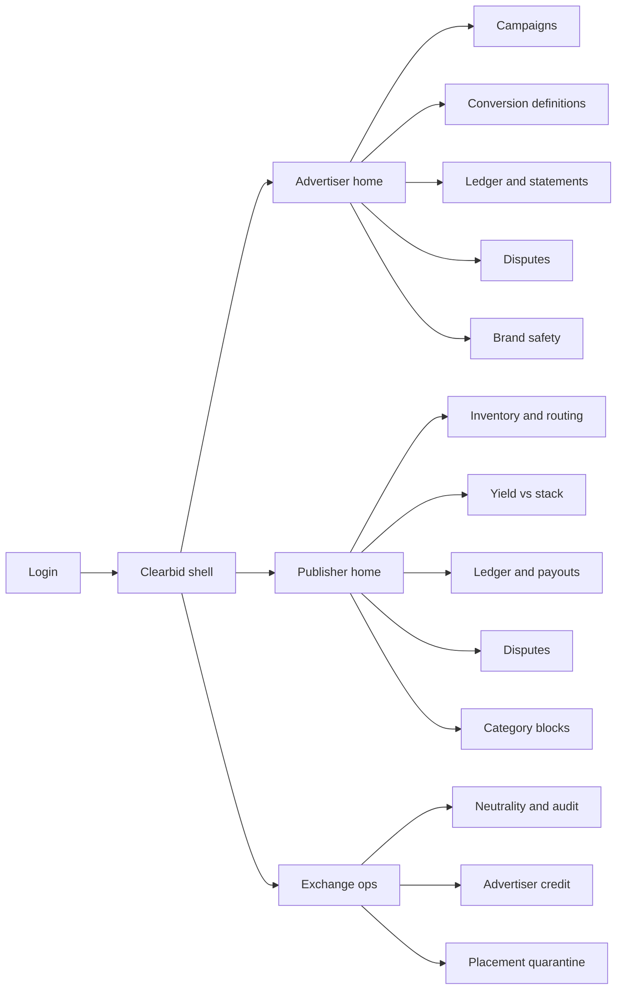
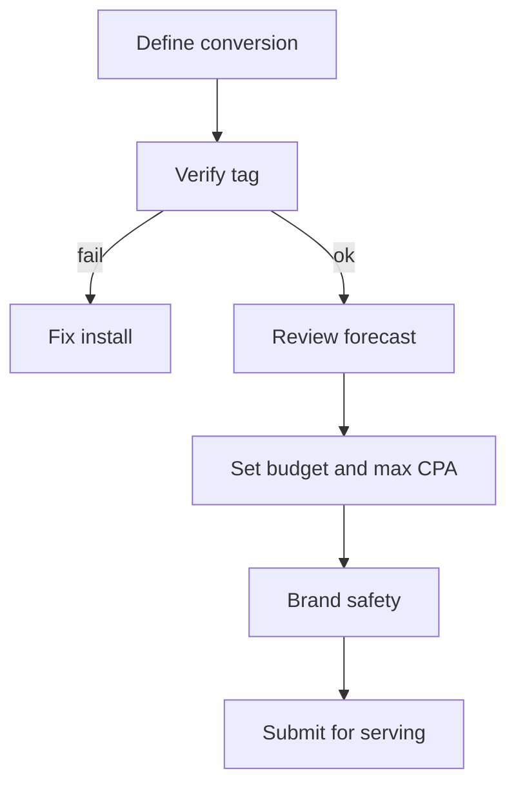
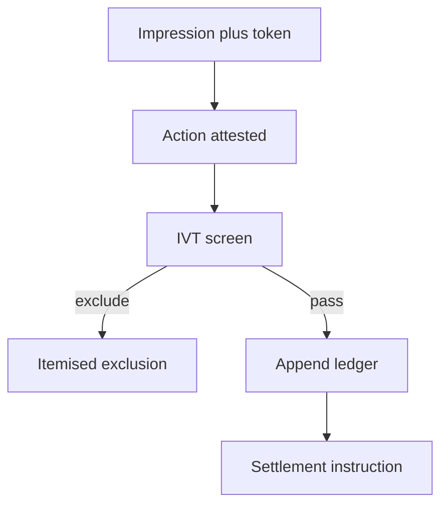

# Clearbid — Web app

**Product:** [PRODUCT.md](./PRODUCT.md)
**Primary surface:** Dual-sided exchange console (Advertiser workspace + Publisher workspace under one Clearbid shell)
**Secondary surfaces:** Finance statement export viewer (read-only PDF/CSV); public neutrality attestation page (read-only proof)
**Design thesis:** Clearbid is a clearing house that happens to run ads — the UI metaphor is a settlement ledger and auction floor, not a marketing “insights” dashboard. Visual language is cool graphite and ledger-green confirmation on a deep slate ground: numbers that settle feel final; disputed rows feel provisional. The brand wordmark sits as a quiet mint mark on every money-bearing screen so counterparties always know whose neutrality they are trusting.

## UX research synthesis

### Category peers (best-in-class)

- **Google DV360:** Customizable trader tables, stable Campaign → IO → Line Item navigation, inline editable pacing/bid columns, bulk ops via structured files. Steal: dense but scannable performance grids and saved column views keyed to CPA/verified-action metrics — not vanity CTR.
- **Amazon DSP (post-facelift):** Goal Performance and Pacing dashboards, Missed Opportunities explanations, report-from-context. Steal: “why you lost” and “budget at risk” panels next to the object being managed; reject Amazon’s advertiser hierarchy labels where Clearbid’s model is Campaign + ConversionDefinition.
- **TradeMesh (ADX control plane):** Request → route → auction → ledger → audit as one operating record. Steal: evidence-linked navigation — every revenue number drills to ledger evidence, not a disconnected BI chart.
- **AdKernel CPA Suite / Nexus CPA modules:** Self-serve advertiser + publisher UIs, conversion feedback bidding, offer/payout caps. Steal: dual-sided shell with role-gated nav; reject affiliate-network “offer wall” aesthetics that signal untrusted CPA networks.

### Patterns to adopt / reject

- **Adopt:** Dual home (demand vs supply); append-only ledger as first-class nav; verified CPA as the default KPI column; itemised IVT exclusions as accounting events; explainable bid breakdown (segment × p(action) × value); time-boxed dispute workspace with evidence panes; disclosed take-rate as a single line on every statement.
- **Reject:** Impression-first dashboards that bury conversions; agency-style black-box “optimisation score”; editable conversion totals; rainbow KPI tiles; purple gradient “AI insights” panels; chatbots as the primary campaign builder.

### Trust, density, and workflow constraints from PRODUCT.md

Operators need finance-grade density without exposing peer commercial secrets (BR-1, BR-8): verification shows proofs and counts, never raw user-level data or advertiser revenue-per-customer to publishers. Neutrality must be demonstrable in-product (BR-12): settled rows are visually immutable; operator actions appear in an audit rail. Campaign launch must be self-serve without an agency (BR-6) yet still support incumbent reconciliation (change-management). Fraud quarantine and brand-safety blocks are settlement-blocking events (BR-5, BR-11), so status chrome must be impossible to miss.

## Information architecture

### Nav model

### Roles → default home

| Role | Default home | Why |
|------|--------------|-----|
| Performance marketer / media buyer | Advertiser home — verified CPA vs incumbent | Daily budget and action focus (BR-3) |
| Publisher monetisation / ad ops | Publisher home — eRPM vs current stack | Routing decision surface |
| Fraud / quality analyst | Placement quarantine queue | Cap exposure (BR-5) |
| Finance / revenue assurance | Period statements | Month-close without spreadsheets (BR-10) |
| Compliance / platform admin | Neutrality and audit | Demonstrate append-only ledger (BR-12) |
| Credit officer | Advertiser credit | Deferred-payment eligibility (BR-9) |

### Cross-links to OpenAPI resources

| Nav area | OpenAPI tags / resources |
|----------|---------------------------|
| Campaigns | Campaigns |
| Inventory and routing | Inventory |
| Bid explain / forecasts | Bidding |
| Ledger, conversions, IVT | Conversions |
| Statements, payouts | Settlement |
| Disputes | Disputes |
| Exports, CPA comparison | Reporting |

## Screen inventory

### Advertiser home

- **Purpose:** Answer “is Clearbid beating my incumbent on verified CPA this cycle?” in one composition.
- **Entry:** Post-login for advertiser roles; deep link from campaign alerts.
- **Layout regions:** Brand + workspace switcher (top); primary KPI strip (verified CPA, spend clearing without dispute, share on CPA vs fallback); comparison chart vs incumbent conversion definition; active campaigns table; alerts rail (quarantines, disputes nearing deadline).
- **Primary actions:** Open campaign; export period comparison; jump to open disputes.
- **Empty / loading / error:** Empty = guided “define first conversion + launch campaign”; loading = skeleton KPI + table; error = retry with request id.
- **BR / story ties:** BR-3; performance marketer stories on CPA comparison and IVT-free invoices.

### Campaign list and editor

- **Purpose:** Create and pace campaigns priced on target actions, with disclosed take-rate.
- **Entry:** Advertiser nav → Campaigns; create from home CTA.
- **Layout regions:** Filterable campaign table (status, verified CPA, pacing, p(action) health); editor panes: ConversionDefinition, budget/max CPA, targeting constraints, brand-safety rules, forecast panel (expected volume and cost), take-rate disclosure line.
- **Primary actions:** Save draft; submit for serving; pause; duplicate; open bid explain for a placement sample.
- **Empty / loading / error:** Empty = template for lead-gen vertical; validation errors inline on conversion tag and consent basis.
- **BR / story ties:** BR-2, BR-6, BR-7; marketer stories on defining actions and pre-commit forecast.

### Conversion definitions

- **Purpose:** Make the commercial object (registration, form, callback, purchase) explicit and reconciliable with incumbent measurement.
- **Entry:** Campaign editor or dedicated nav.
- **Layout regions:** Definition list; detail with event schema, attribution window, tag install status, mapping to incumbent conversion id.
- **Primary actions:** Create definition; verify test event; map to incumbent for BR-3 comparison.
- **Empty / loading / error:** Empty = choose action type wizard; error = tag not firing with diagnostic steps.
- **BR / story ties:** BR-2, BR-3, BR-8.

### Bid explain

- **Purpose:** Show why a bid was (or would be) made: segment, predicted action probability, expected economic value — not a black box score.
- **Entry:** From campaign → sample request; from reporting drill-down.
- **Layout regions:** Request context (consent gate pass/fail); eligible campaigns ranked; selected campaign breakdown; rejected peers with reason codes.
- **Primary actions:** Pin explanation to campaign notes; export for buyer review.
- **Empty / loading / error:** No eligible campaigns → consent or brand-safety block explanation.
- **BR / story ties:** BR-7, BR-8.

### Advertiser ledger and statements

- **Purpose:** Dual-readable conversion ledger and period statements tying actions → exclusions → invoices.
- **Entry:** Advertiser nav → Ledger; finance home shortcut.
- **Layout regions:** Ledger table (append-only rows: attested, confirmed, excluded, disputed); filters by campaign/period; statement drawer (take-rate line, IVT itemisation, dispute reserve); export controls.
- **Primary actions:** Open conversion evidence; export statement; open dispute on a row.
- **Empty / loading / error:** Empty period = “no settled actions”; immutable row styling when settled.
- **BR / story ties:** BR-1, BR-4, BR-5, BR-10; finance stories.

### Publisher home

- **Purpose:** Decide how much remnant inventory to route based on predicted Clearbid eRPM vs current demand stack.
- **Entry:** Publisher login default.
- **Layout regions:** Yield comparison (Clearbid vs stack); fill and payout timing; inventory health; disputes/quarantine alerts.
- **Primary actions:** Adjust routing share; open inventory; open payout schedule.
- **Empty / loading / error:** Empty = register first property/slots.
- **BR / story ties:** BR-9; monetisation manager stories.

### Inventory and routing

- **Purpose:** Register properties, slot taxonomy, and routing percentages for remnant/secondary inventory.
- **Entry:** Publisher nav.
- **Layout regions:** Property tree; slot table; routing slider vs other demand; category block summary.
- **Primary actions:** Add slot; set routing; sync ad server integration status.
- **Empty / loading / error:** Integration error with ad server/header bidder shown as blocking banner.
- **BR / story ties:** Change-management remnant entry; BR-11 adjacency.

### Publisher ledger and payouts

- **Purpose:** Confirm conversions independently and see predictable payout timing under credit policy.
- **Entry:** Publisher nav → Ledger / Payouts.
- **Layout regions:** Same ledger primitives as advertiser but publisher-safe columns (no advertiser RPC); payout calendar; minimum threshold status; deferred-payment advertiser flags without sensitive detail.
- **Primary actions:** Export payout remittance; raise dispute; view settlement timing policy.
- **Empty / loading / error:** Below threshold = progress to payout.
- **BR / story ties:** BR-1, BR-4, BR-9, BR-10.

### Disputes workspace

- **Purpose:** Time-boxed adjudication with ledger evidence; unresolved disputes resolve in favour of recorded evidence.
- **Entry:** Alerts, ledger row action, or Disputes nav (both sides).
- **Layout regions:** Queue (deadline countdown); case view with dual evidence panes; resolution log; settlement impact preview.
- **Primary actions:** Submit evidence; accept/reject; escalate to exchange ops.
- **Empty / loading / error:** Empty = no open disputes; expired = locked resolution state.
- **BR / story ties:** BR-4; compliance exception path.

### Placement quarantine

- **Purpose:** Automatic IVT threshold breaches surface as capped exposure with human review.
- **Entry:** Ops/fraud default; advertiser/publisher alerts.
- **Layout regions:** Quarantine queue; traffic pattern charts; placement identity; release/keep controls with reason codes.
- **Primary actions:** Keep quarantined; release with note; open related exclusions.
- **Empty / loading / error:** Empty = healthy inventory message (not a blank void).
- **BR / story ties:** BR-5; fraud analyst stories.

### Brand safety and category blocks

- **Purpose:** Advertiser pre-serve controls and publisher category blocks; violations block settlement.
- **Entry:** Advertiser Brand safety; Publisher Category blocks.
- **Layout regions:** Policy lists; violation log; settlement-block banner when active.
- **Primary actions:** Add rule; test against sample inventory/creatives.
- **Empty / loading / error:** No policies = warning that defaults are permissive.
- **BR / story ties:** BR-11.

### Neutrality and audit (exchange ops)

- **Purpose:** Demonstrate that neither exchange nor counterparty can silently rewrite settled conversions.
- **Entry:** Ops/compliance home.
- **Layout regions:** Ledger integrity attestation; operator action log; consent-basis evidence packs; export for regulator/publisher privacy review.
- **Primary actions:** Generate neutrality report; open consent sample (aggregated).
- **Empty / loading / error:** Attestation failure = red blocking state with runbook link.
- **BR / story ties:** BR-8, BR-12; platform administrator stories.

### Advertiser credit

- **Purpose:** Rating governs deferred-payment eligibility without uncontrolled counterparty risk.
- **Entry:** Ops credit; finance.
- **Layout regions:** Rating table; terms policy; eligibility changes with audit trail.
- **Primary actions:** Approve/deny terms; notify advertiser.
- **Empty / loading / error:** Pending applications queue empty state.
- **BR / story ties:** BR-9; finance credit story.

## Key flows

1. **Launch CPA campaign** — define conversion → forecast → set max CPA → brand safety → disclose take-rate → go live; failure: tag not verified or consent basis missing (block serve).

2. **Impression to settlement** — serve with attribution token → advertiser attests action → IVT screen → ledger append → settle or exclude; failure: IVT exclusion itemised to both sides.

3. **Dispute shaving claim** — publisher opens dispute on ledger row → time box → evidence → resolve or auto-resolve for recorded evidence (BR-4).

4. **Incumbent CPA comparison** — map conversion definition → run cycle → export verified CPA vs incumbent for internal budget shift (BR-3).

5. **Quarantine release review** — threshold breach auto-quarantines → analyst reviews patterns → keep or release with reason → related campaigns notified.

## Design system

### Tokens (CSS variables)

- `--color-ink: #E8EEF2` — primary text on dark ground
- `--color-slate-950: #0B1218` — app ground
- `--color-slate-900: #121C26` — panels
- `--color-slate-700: #2A3A4A` — rules/dividers
- `--color-mint: #3DDC97` — settled / verified confirmation (ledger green)
- `--color-mint-dim: #1F6B4A` — mint on dark backgrounds
- `--color-amber: #E6A23C` — dispute / provisional
- `--color-coral: #E85D4C` — quarantine / settlement-block
- `--color-steel: #7A9BB0` — secondary labels
- `--color-brand: #9FD9C4` — Clearbid wordmark accent (quiet mint, not neon)
- `--font-display: "IBM Plex Sans", sans-serif` — console chrome and KPIs
- `--font-mono: "IBM Plex Mono", monospace` — ledger ids, hashes, statements
- `--space-1`…`--space-8`: 4px scale
- `--radius-sm: 4px`; `--radius-md: 8px` — sharp-ish clearing-house, not pill-heavy
- `--motion-settle: 180ms ease-out` — row confirm flash
- `--motion-dispute: 240ms ease-in-out` — amber pulse on deadline
- Atmosphere: subtle horizontal hairline grid in slate-900 (ledger paper), soft top vignette; no stock stock-photo heroes in console.

### Typography & brand

- Display for KPI numerals and screen titles; mono for conversion ids, attestation hashes, statement lines.
- Brand wordmark left of shell chrome on every money-bearing view; never replaced by a generic “Dashboard” title as the strongest mark.
- Marketing/login shell: brand as hero-level signal; one headline (“Settle on verified actions”); one CTA — no stat strips.

### Do / don’t

- **Do:** Treat settled ledger rows as visually locked; show take-rate as one explicit line; dual-pane evidence in disputes; role-gated columns so publishers never see advertiser RPC.
- **Don’t:** Purple AI glow; editable totals; impression-primary KPI default; card grids for static metrics; emoji status; rounded-full pills for every filter.

### Accessibility & domain trust cues

- Contrast AA+ on mint/amber/coral against slate; do not rely on colour alone — settled rows also show lock icon + “Settled” text.
- Live regions announce quarantine and dispute deadline changes.
- Focus order follows money flow: definition → campaign → ledger → statement.
- Neutrality page exposes machine-readable attestation for auditors.

## Component patterns

- **SettlementLedgerRow** — append-only row with state (attested / confirmed / excluded / disputed / settled) and evidence affordance.
- **TakeRateLine** — single disclosed platform fee on forecasts and statements.
- **VerifiedCpaCompare** — Clearbid vs incumbent for mapped conversion definition.
- **BidExplainPanel** — segment × p(action) × value breakdown.
- **DisputeDeadlineChip** — amber countdown; coral when overdue.
- **QuarantineBanner** — settlement-blocking placement state.
- **WorkspaceSwitch** — Advertiser / Publisher / Ops without losing deep link context where permitted.
- **EvidencePackageExport** — period statement + ledger slice for finance/audit.

## Out of scope for v1 web

- Full creative production studio; agency trading-desk white-label portal; mobile-native trader apps; real-time bid-stream debugger for exchange engineers (API/logs only); end-user consumer UI; replacement of publisher primary ad server.
